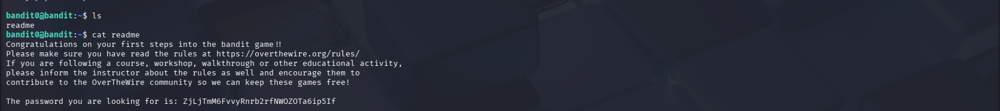

# OverTheWire Bandit – Level 0 (Detailed Walkthrough)

## 🔐 Level Objective
The objective of **Bandit Level 0** is to obtain the password for the next level.

At Level 0, the password is stored in a file named:

```
readme
```

This file is located in the **home directory** of the `bandit0` user.

---

## 🖥️ Environment Details
- Operating System: Kali Linux (VirtualBox)
- Wargame: OverTheWire Bandit
- Connection Method: SSH
- Port: 2220
- Current User: `bandit0`

---

## 🔑 Login Command
```bash
ssh bandit0@bandit.labs.overthewire.org -p 2220
```

After logging in successfully, the terminal prompt appears as:
```bash
bandit0@bandit:~$
```

---

## 🧪 Commands Used and Explanation

### 1️⃣ List files in the home directory
```bash
ls
```

### Output:
```
readme
```

📌 **Explanation**:
- The `ls` command lists files in the current directory
- It reveals a file named `readme` that likely contains useful information

---

### 2️⃣ Read the contents of the `readme` file
```bash
cat readme
```

📌 **Explanation**:
- The `cat` command displays the contents of a file
- The `readme` file contains instructions and the password for the next level

---

## 🔐 Password Obtained
```
zjLjTmM6FvvyRnrb2rfNWOZOTa6ip5If
```

This is the password for **Bandit Level 1**.

---

## ➡️ Login to the Next Level
```bash
ssh bandit1@bandit.labs.overthewire.org -p 2220
```
Use the password shown above.

---

## 🖼️ Screenshot Evidence

### 📷 Terminal Output – Reading the `readme` File


---

## 📘 Key Learning Outcomes
- `ls` is used to list files in a directory
- `cat` is used to read file contents
- Important information is often stored in plain text files
- Always read README files when starting new challenges
- This level introduces basic Linux command usage

---

## ✅ Completion Status
✔️ Bandit Level 0 successfully completed
