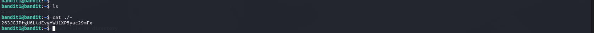

# OverTheWire Bandit – Level 1 → Level 2 (Detailed Walkthrough)

## 🔐 Level Objective
The objective of **Bandit Level 1 → Level 2** is to retrieve the password for the next level.

In this level, the password is stored in a file named:

```
-
```

This file is located in the **home directory**.

---

## 🖥️ Environment Details
- Operating System: Kali Linux (VirtualBox)
- Wargame: OverTheWire Bandit
- Connection Method: SSH
- Port: 2220
- Current User: `bandit0`

---

## 🔑 Login Command
```bash
ssh bandit0@bandit.labs.overthewire.org -p 2220
```

After successful login, the terminal prompt appears as:
```bash
bandit0@bandit:~$
```

---

## 🧪 Commands Used and Explanation

### 1️⃣ List files in the home directory
```bash
ls
```

### Output:
```
-
```

📌 **Explanation**:
- The `ls` command lists files in the current directory
- The filename is `-`, which is a special character in Linux
- Files starting with `-` are often misinterpreted as command options

---

### 2️⃣ Read the file named `-` safely
```bash
cat ./-
```

📌 **Explanation**:
- Using `-` alone would be treated as standard input
- Prefixing with `./` forces Linux to treat it as a filename
- This command correctly displays the file contents

---

## 🔐 Password Obtained
```
263JGJPfgU6LdEvgfW1XP5yac29mFx
```

This is the password for **Bandit Level 1**.

---

## ➡️ Login to the Next Level
```bash
ssh bandit1@bandit.labs.overthewire.org -p 2220
```
Use the password shown above.

---

## 🖼️ Screenshot Evidence

### 📷 Terminal Output – Reading File Named `-`


---

## 📘 Key Learning Outcomes
- Filenames beginning with `-` can be misinterpreted as command options
- `./` is used to explicitly reference files in the current directory
- `ls` helps identify unusual filenames
- `cat` reads file contents safely when handled correctly
- Understanding special filenames is essential in Linux and CTF challenges

---

## ✅ Completion Status
✔️ Bandit Level 1 → Level 2 successfully completed
