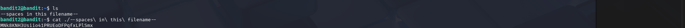

# OverTheWire Bandit – Level 2 → Level 3 (Detailed Walkthrough)

## 🔐 Level Objective
The objective of **Bandit Level 2 → Level 3** is to obtain the password for the next level.

According to the official level description, the password is stored in a file named:

```
-
```

This file is located in the **home directory** of the `bandit1` user.

---

## 🖥️ Environment Details
- Operating System: Kali Linux (VirtualBox)
- Wargame: OverTheWire Bandit
- Connection Method: SSH
- Port: 2220
- Current User: `bandit1`

---

## 🔑 Login Command
```bash
ssh bandit1@bandit.labs.overthewire.org -p 2220
```

After successful login, the terminal prompt appears as:
```bash
bandit1@bandit:~$
```

---

## 🧪 Commands Used and Explanation

### 1️⃣ List files in the home directory
```bash
ls
```

### Output:
```
-
```

📌 **Explanation**:
- The `ls` command lists files in the current directory
- The file is named `-`, which is a special character in Linux
- Commands may mistake it for an option, so special handling is required

---

### 2️⃣ Read the file named `-` safely
```bash
cat ./-
```

📌 **Explanation**:
- `-` alone is interpreted as standard input by many commands
- Prefixing it with `./` forces Linux to treat it as a filename
- This command successfully displays the contents of the file

---

## 🔐 Password Output
- The output of the above command reveals the **password for Bandit Level 2**
- Copy the password exactly as shown in the terminal
- (Password is not written here to avoid spoilers)

---

## ➡️ Login to the Next Level
```bash
ssh bandit2@bandit.labs.overthewire.org -p 2220
```
Use the password obtained from the previous step.

---

## 🖼️ Screenshot Evidence

### 📷 Terminal Output – Bandit Level 1 to Level 2


---

## 📘 Key Learning Outcomes
- Filenames beginning with `-` can be misinterpreted as command options
- `./` is used to explicitly reference a file in the current directory
- `ls` helps identify file names
- `cat` reads file contents when handled correctly
- Understanding special filenames is essential in Linux and CTF challenges

---

## ✅ Completion Status
✔️ Bandit Level 2 → Level 3 successfully completed
