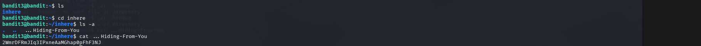

# OverTheWire Bandit – Level 2 → Level 3 (Detailed Walkthrough)

## 🔐 Level Objective
The objective of **Bandit Level 2 → Level 3** is to find the password for the next level.

According to the level description, the password is stored in a **hidden file** located inside a directory named:

```
inhere
```

---

## 🖥️ Environment Details
- Operating System: Kali Linux (VirtualBox)
- Wargame: OverTheWire Bandit
- Connection Method: SSH
- Port: 2220
- Current User: `bandit3`

---

## 🔑 Login Command
```bash
ssh bandit3@bandit.labs.overthewire.org -p 2220
```

After successful login, the terminal prompt appears as:
```bash
bandit3@bandit:~$
```

---

## 🧪 Commands Used and Explanation

### 1️⃣ List files in the home directory
```bash
ls
```

### Output:
```
inhere
```

📌 **Explanation**:
- The `ls` command lists visible files and directories
- It reveals a directory named `inhere`, which likely contains the password file

---

### 2️⃣ Change into the `inhere` directory
```bash
cd inhere
```

📌 **Explanation**:
- `cd` is used to change directories
- The password file is stored inside this directory

---

### 3️⃣ List all files including hidden files
```bash
ls -a
```

### Output:
```
.
..
.Hiding-From-You
```

📌 **Explanation**:
- Hidden files in Linux start with a dot (`.`)
- `ls -a` displays **all files**, including hidden ones
- The file `.Hiding-From-You` is identified as the target

---

### 4️⃣ Read the hidden file
```bash
cat .Hiding-From-You
```

📌 **Explanation**:
- `cat` reads the contents of a file
- This command displays the password for **Bandit Level 4**

---

## 🔐 Password Result
- The command outputs the **password for Bandit Level 4**
- The password is visible in the terminal output (see screenshot)
- Copy it exactly as shown for the next login

---

## ➡️ Login to the Next Level
```bash
ssh bandit4@bandit.labs.overthewire.org -p 2220
```

Use the password obtained from the previous step.

---

## 🖼️ Screenshot Evidence

### 📷 Terminal Output – Hidden File Discovery and Password


---

## 📘 Key Learning Outcomes
- Hidden files start with a dot (`.`)
- `ls` does not show hidden files by default
- `ls -a` is required to reveal hidden files
- Directory navigation using `cd` is essential
- Many CTF challenges hide sensitive data intentionally

---

## ✅ Completion Status
✔️ Bandit Level 2 → Level 3 successfully completed
