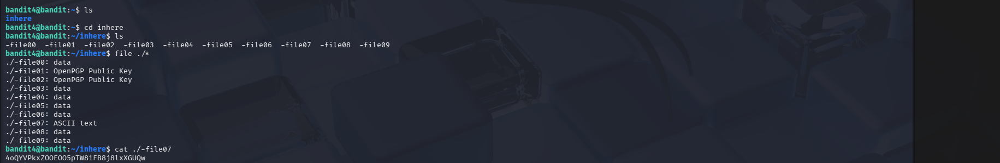

# OverTheWire Bandit – Level 3 → Level 4 (Detailed Walkthrough)

## 🔐 Level Objective
The objective of **Bandit Level 3 → Level 4** is to find the password for the next level.

According to the level description, the password is stored in **one of the files inside the `inhere` directory**, and the correct file is the one that contains **human-readable text**.

---

## 🖥️ Environment Details
- Operating System: Kali Linux (VirtualBox)
- Wargame: OverTheWire Bandit
- Connection Method: SSH
- Port: 2220
- Current User: `bandit4`

---

## 🔑 Login Command
```bash
ssh bandit4@bandit.labs.overthewire.org -p 2220
```

After successful login, the terminal prompt appears as:
```bash
bandit4@bandit:~$
```

---

## 🧪 Commands Used and Explanation

### 1️⃣ List files in the home directory
```bash
ls
```

### Output:
```
inhere
```

📌 **Explanation**:
- The `ls` command shows a directory named `inhere`
- The password file is located inside this directory

---

### 2️⃣ Change into the `inhere` directory
```bash
cd inhere
```

📌 **Explanation**:
- Moves into the directory containing multiple files

---

### 3️⃣ List all files inside the directory
```bash
ls
```

### Output:
```
-file00  -file01  -file02  -file03  -file04
-file05  -file06  -file07  -file08  -file09
```

📌 **Explanation**:
- There are multiple files
- All filenames begin with `-`, so they must be handled carefully

---

### 4️⃣ Identify the human-readable file
```bash
file ./*
```

### Output (important part):
```
./-file07: ASCII text
```

📌 **Explanation**:
- The `file` command identifies file types
- Most files contain binary data
- `-file07` is identified as **ASCII text**, meaning it is readable and likely contains the password

---

### 5️⃣ Read the correct file
```bash
cat ./-file07
```

📌 **Explanation**:
- `./` ensures the filename is not treated as an option
- This command displays the password for the next level

---

## 🔐 Password Obtained
```
40QYVPkxZQOOE05pTW81FB8j8lxXGQw
```

This is the password for **Bandit Level 5**.

---

## ➡️ Login to the Next Level
```bash
ssh bandit5@bandit.labs.overthewire.org -p 2220
```
Use the password shown above.

---

## 🖼️ Screenshot Evidence



---

## 📘 Key Learning Outcomes
- The `file` command is useful for identifying readable files
- Not all files contain text even if they look similar
- Filenames starting with `-` must be prefixed with `./`
- Methodical enumeration is essential in CTF challenges

---

## ✅ Completion Status
✔️ Bandit Level 3 → Level 4 successfully completed
