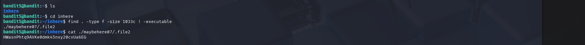

# OverTheWire Bandit – Level 5 → Level 6 (Detailed Walkthrough)

## 🔐 Level Objective
The goal of **Bandit Level 5 → Level 6** is to find the password for the next level.

The password is stored in a file that meets **all** of the following conditions:
- Located somewhere under the `inhere` directory
- Human-readable (ASCII text)
- Exactly **1033 bytes** in size
- **Not executable**

---

## 🖥️ Environment Details
- Wargame: OverTheWire Bandit
- Current User: `bandit5`
- Login Method: SSH
- Port: 2220
- Working Directory: `/home/bandit5`

---

## 🔑 Login Command
```bash
ssh bandit5@bandit.labs.overthewire.org -p 2220
```

---

## 🧪 Commands Used and Explanation

### 1️⃣ List files in the home directory
```bash
ls
```

### Output:
```
inhere
```

📌 **Explanation**:
- The `inhere` directory contains multiple nested files
- The password is hidden somewhere inside this directory

---

### 2️⃣ Change into the `inhere` directory
```bash
cd inhere
```

---

### 3️⃣ Search for the correct file using `find`
```bash
find . -type f -size 1033c ! -executable
```

📌 **Explanation**:
- `find .` → search from the current directory
- `-type f` → only regular files
- `-size 1033c` → file size exactly 1033 bytes
- `! -executable` → exclude executable files

### Output:
```
./maybehere07/.file2
```

✅ This file matches **all required conditions**.

---

### 4️⃣ Read the contents of the identified file
```bash
cat ./maybehere07/.file2
```

---

## 🔐 Password Obtained
```
HWasnPhTq9AVKe0dmk45nxy20cvUa6EG
```

This is the password for **Bandit Level 6**.

---

## ➡️ Login to the Next Level
```bash
ssh bandit6@bandit.labs.overthewire.org -p 2220
```
Use the password shown above.

---

## 🖼️ Screenshot Evidence

### 📷 Terminal Output – Finding the Correct File


---

## 📘 Key Learning Outcomes
- Recursive file searching using `find`
- Filtering files by exact size using bytes (`c`)
- Excluding executable files
- Handling hidden files inside nested directories
- Combining multiple conditions to efficiently locate sensitive data

---

## ✅ Completion Status
✔️ Bandit Level 5 → Level 6 successfully completed
