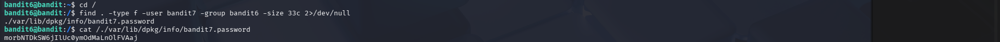

# OverTheWire Bandit – Level 6 → Level 7

## 🔐 Level Objective
The password for the next level is stored in a file that:
- Is owned by user **bandit7**
- Is owned by group **bandit6**
- Has a size of **33 bytes**
- Is located somewhere on the system

---

## 🖥️ Environment Details
- Wargame: OverTheWire Bandit
- Current User: bandit6
- SSH Port: 2220

---

## 🔑 Login Command
```bash
ssh bandit6@bandit.labs.overthewire.org -p 2220
```

---

## 🧪 Commands Used

### Move to root directory
```bash
cd /
```

### Search for the password file
```bash
find / -type f -user bandit7 -group bandit6 -size 33c 2>/dev/null
```

### Output
```text
/var/lib/dpkg/info/bandit7.password
```

### Read the password file
```bash
cat /var/lib/dpkg/info/bandit7.password
```

---

## 🔐 Password Found
```text
morbNTDkSW6jIUCOymOdMaLnOlFVAaj
```

---

## ➡️ Login to Next Level
```bash
ssh bandit7@bandit.labs.overthewire.org -p 2220
```

---

## 🖼️ Screenshot Evidence


---

## 📘 Key Concepts Learned
- Recursive file searching with `find`
- Filtering files by user and group ownership
- Searching files by exact byte size
- Suppressing permission errors using `2>/dev/null`

---

## ✅ Level Status
✔️ Bandit Level 6 → Level 7 Completed Successfully
