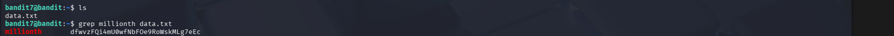

# OverTheWire Bandit – Level 7 → Level 8

## 🔐 Level Objective
The password for the next level is stored in the file `data.txt`  
The password is located **next to the word `millionth`**.

---

## 🖥️ Environment Details
- Wargame: OverTheWire Bandit
- Current User: bandit7
- SSH Port: 2220

---

## 🔑 Login Command
```bash
ssh bandit7@bandit.labs.overthewire.org -p 2220
```

---

## 🧪 Commands Used

### List files in the home directory
```bash
ls
```

### Output
```text
data.txt
```

### Search for the word "millionth" inside the file
```bash
grep millionth data.txt
```

### Output
```text
millionth    dfwvzFQi4mU0wFNbFOe9RoWskMLg7eEc
```

---

## 🔐 Password Found
```text
dfwvzFQi4mU0wFNbFOe9RoWskMLg7eEc
```

---

## ➡️ Login to Next Level
```bash
ssh bandit8@bandit.labs.overthewire.org -p 2220
```

---

## 🖼️ Screenshot Evidence


---

## 📘 Key Concepts Learned
- Searching text within files using `grep`
- Pattern matching in large text files
- Extracting specific information from structured data

---

## ✅ Level Status
✔️ Bandit Level 7 → Level 8 Completed Successfully
