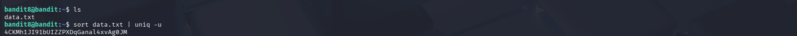

# OverTheWire Bandit – Level 8 → Level 9

## 🎯 Level Objective
The goal of **Bandit Level 8 → Level 9** is to find the password for the next level.  
The password is stored in the file `data.txt` and is the **only line that occurs once** in the file.

All other lines in the file appear multiple times.

---

## 🖥️ Environment Details
- Wargame: OverTheWire Bandit
- Current User: bandit8
- SSH Port: 2220
- Home Directory File: `data.txt`

---

## 🔐 Login Command
```bash
ssh bandit8@bandit.labs.overthewire.org -p 2220
```

---

## 🧪 Commands Used

### 1️⃣ List files in the home directory
```bash
ls
```

**Output:**
```text
data.txt
```

📌 This confirms the presence of the file containing the password.

---

### 2️⃣ Find the unique line in the file
```bash
sort data.txt | uniq -u
```

**Explanation:**
- `sort data.txt` → Sorts all lines alphabetically
- `uniq -u` → Displays only lines that appear **once**
- Since the password appears only once, this command reveals it

---

## 🔐 Password Found
```text
4CKMh1JI91bUIZZPXDqGanal4xvAg0JM
```

---

## ➡️ Login to Next Level
```bash
ssh bandit9@bandit.labs.overthewire.org -p 2220
```

---

## 🖼️ Screenshot Evidence


---

## 📘 Key Concepts Learned
- Sorting file contents using `sort`
- Identifying unique lines using `uniq -u`
- Using pipelines (`|`) to combine commands
- Analyzing large text files efficiently

---

## ✅ Level Status
✔️ Bandit Level 8 → Level 9 Completed Successfully
