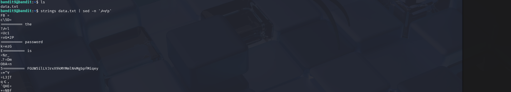

# OverTheWire Bandit – Level 9 → Level 10

## 🎯 Level Objective
The goal of **Bandit Level 9 → Level 10** is to find the password for the next level.  
The password is stored in the file `data.txt`.

The file contains mostly **binary data**, but the password is hidden as a **human-readable string** that follows the `=` character.

---

## 🖥️ Environment Details
- Wargame: OverTheWire Bandit
- Current User: bandit9
- SSH Port: 2220
- Home Directory File: `data.txt`

---

## 🔐 Login Command
```bash
ssh bandit9@bandit.labs.overthewire.org -p 2220
```

---

## 🧪 Commands Used

### 1️⃣ List files in the home directory
```bash
ls
```

**Output:**
```text
data.txt
```

📌 Confirms the presence of the target file.

---

### 2️⃣ Extract readable strings and filter lines containing '='
```bash
strings data.txt | sed -n '/=/p'
```

**Explanation:**
- `strings data.txt` → Extracts human-readable text from a binary file
- `sed -n '/=/p'` → Prints only lines containing the `=` character
- The password is located after the `=` symbol

---

## 🔐 Password Found
```text
FGUW5ilLVJrxX9kMYMmlN4MgbpfMiqey
```

---

## ➡️ Login to Next Level
```bash
ssh bandit10@bandit.labs.overthewire.org -p 2220
```

---

## 🖼️ Screenshot Evidence


---

## 📘 Key Concepts Learned
- Handling binary files in Linux
- Extracting readable text using `strings`
- Pattern filtering with `sed`
- Understanding hidden data within non-text files

---

## ✅ Level Status
✔️ Bandit Level 9 → Level 10 Completed Successfully
