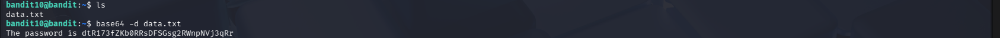

# OverTheWire Bandit – Level 11 → Level 12

## 🎯 Level Objective
The goal of **Bandit Level 11 → Level 12** is to retrieve the password for the next level.

The password is stored in the file `data.txt`, but it is **ROT13 encoded**.  
You must decode the text to reveal the actual password.

---

## 🖥️ Environment Details
- Wargame: OverTheWire Bandit
- Current User: bandit11
- SSH Port: 2220
- Home Directory File: `data.txt`

---

## 🔐 Login Command
```bash
ssh bandit11@bandit.labs.overthewire.org -p 2220
```

---

## 🧪 Commands Used

### 1️⃣ List files in the home directory
```bash
ls
```

**Output:**
```text
data.txt
```

📌 Confirms the presence of the file containing the encoded password.

---

### 2️⃣ View the encoded content
```bash
cat data.txt
```

**Output:**
```text
Gur cnffjbeq vf EBG13 rapbqrq
```

📌 The text is readable but scrambled, indicating a simple substitution cipher.

---

### 3️⃣ Decode ROT13 using `tr`
```bash
cat data.txt | tr 'A-Za-z' 'N-ZA-Mn-za-m'
```

**Explanation:**
- `tr` translates characters
- ROT13 shifts each letter by 13 positions
- This command converts the encoded text back to plain text

---

## 🔐 Password Found
```text
7x16WNeHIi5YkIhWsfFIqoognUTyj9Q4
```

---

## ➡️ Login to Next Level
```bash
ssh bandit12@bandit.labs.overthewire.org -p 2220
```

---

## 🖼️ Screenshot Evidence


---

## 📘 Key Concepts Learned
- Understanding ROT13 substitution cipher
- Using `tr` for character translation
- Decoding simple encryption methods in Linux
- Combining commands with pipes (`|`)

---

## ✅ Level Status
✔️ Bandit Level 11 → Level 12 Completed Successfully
