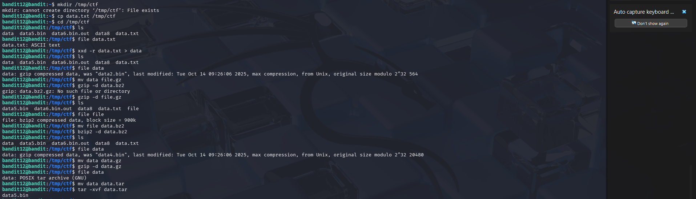
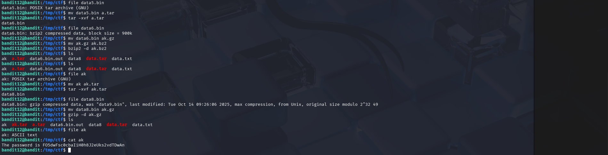

# OverTheWire Bandit – Level 12 → Level 13

## 🎯 Level Objective
The goal of **Bandit Level 12 → Level 13** is to retrieve the password for the next level.

In this level:
- The password is stored in `data.txt`
- The file is **hex-dumped**
- After reversing the hex dump, the file turns into **multiple layers of compressed archives**
- You must identify and extract each layer step by step

---

## 🖥️ Environment Details
- Wargame: OverTheWire Bandit
- Current User: bandit12
- SSH Port: 2220
- Working Directory: `/tmp/ctf`

---

## 🔐 Login Command
```bash
ssh bandit12@bandit.labs.overthewire.org -p 2220
```

---

## 🧪 Commands Used (Step-by-Step)

### 1️⃣ Create a working directory and copy the file
```bash
mkdir /tmp/ctf
cp data.txt /tmp/ctf
cd /tmp/ctf
```

📌 **Reason**:  
Prevents accidental modification of original files and allows free extraction.

---

### 2️⃣ Reverse the hex dump
```bash
xxd -r data.txt > data
```

📌 Converts hex back into binary format.

---

### 3️⃣ Identify file type
```bash
file data
```

**Output:**
```text
gzip compressed data
```

---

### 4️⃣ Rename and decompress (repeat as needed)

```bash
mv data data.gz
gzip -d data.gz
```

Repeat the **file → rename → extract** process:

| File Type | Command Used |
|----------|-------------|
| gzip | `gzip -d` |
| bzip2 | `bzip2 -d` |
| tar | `tar -xvf` |

Examples:
```bash
mv data data.bz2
bzip2 -d data.bz2

mv data data.tar
tar -xvf data.tar
```

📌 This process is repeated **multiple times**, as shown in the screenshots, until the final readable file is obtained.

---

### 5️⃣ Read the final extracted file
```bash
cat ak
```

---

## 🔐 Password Found
```text
F05dwFsc0cbaIiH0h832eUks2vdTDwAn
```

---

## ➡️ Login to Next Level
```bash
ssh bandit13@bandit.labs.overthewire.org -p 2220
```

Use the password above.

---

## 🖼️ Screenshot Evidence





---

## 📘 Key Concepts Learned
- Reversing hex dumps using `xxd`
- Identifying file formats with `file`
- Handling multiple compression formats
- Recursive extraction techniques
- Importance of `/tmp` for safe file operations

---

## ✅ Level Status
✔️ Bandit Level 12 → Level 13 Completed Successfully
