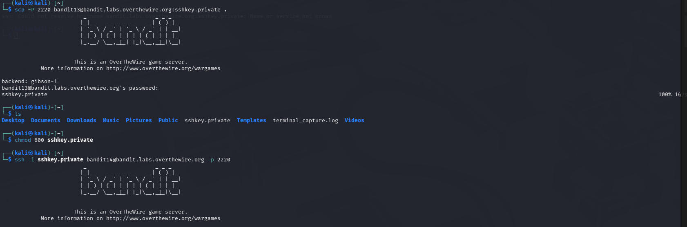
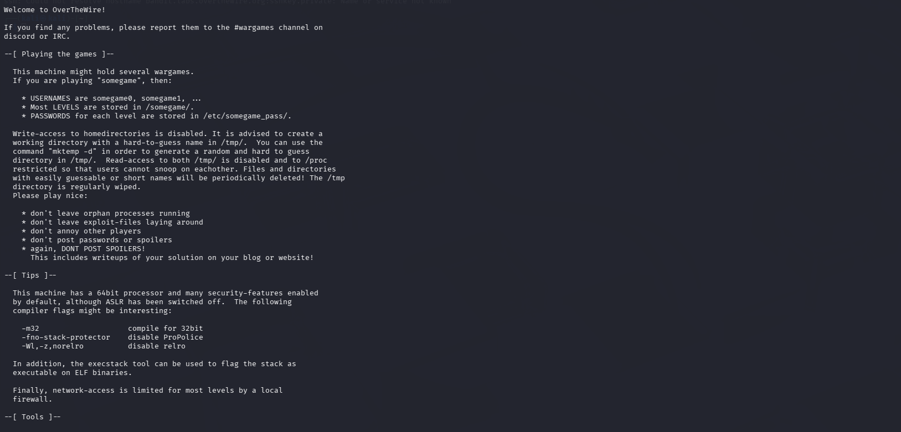
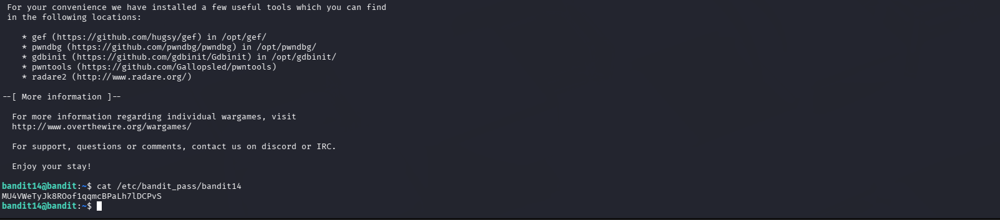

# OverTheWire Bandit – Level 13 → Level 14

## 🎯 Level Objective
The goal of **Bandit Level 13 → Level 14** is to log in to the next level **without using a password**.

In this level:
- You are given an **SSH private key**
- Password login is disabled
- You must authenticate using **SSH key-based authentication**

---

## 🖥️ Environment Details
- Wargame: OverTheWire Bandit
- Current User: bandit13
- SSH Port: 2220
- File Provided: `sshkey.private`

---

## 🔐 Login Command (Current Level)
```bash
ssh bandit13@bandit.labs.overthewire.org -p 2220
```

---

## 🧪 Commands Used (Step-by-Step)

### 1️⃣ List files in the home directory
```bash
ls
```

**Output:**
```text
sshkey.private
```

📌 This file is the **private SSH key** needed to access the next level.

---

### 2️⃣ Set correct permissions for the private key
```bash
chmod 600 sshkey.private
```

📌 **Reason**:  
SSH refuses to use private keys with insecure permissions.

---

### 3️⃣ Login to the next level using the private key
```bash
ssh -i sshkey.private bandit14@bandit.labs.overthewire.org -p 2220
```

📌 `-i` specifies the identity (private key) file.

---

### 4️⃣ Verify successful login
```bash
whoami
```

**Output:**
```text
bandit14
```

✅ You are now logged in as **bandit14**.

---

## 🔐 Password Location (Next Level Hint)
The password for **Level 14 → Level 15** is stored in:
```text
/etc/bandit_pass/bandit14
```

(To be used in the next level.)

---

## 🖼️ Screenshot Evidence







---

## 📘 Key Concepts Learned
- SSH key-based authentication
- Importance of file permissions (`chmod 600`)
- Using private keys with SSH (`-i` option)
- Password-less authentication mechanisms

---

## ✅ Level Status
✔️ Bandit Level 13 → Level 14 Completed Successfully
