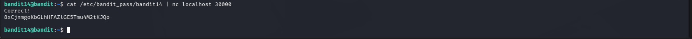

# OverTheWire Bandit – Level 14 → Level 15

## 🎯 Level Objective
The objective of **Bandit Level 14 → Level 15** is to retrieve the password for the next level by **sending the current level’s password to a local service running on port 30000**.

This level introduces:
- Network communication using **netcat (nc)**
- Sending data to a listening service

---

## 🖥️ Environment Details
- Current User: bandit14
- Target Port: 30000
- Service: Listening on localhost
- Password File: `/etc/bandit_pass/bandit14`

---

## 🔐 Command Used

```bash
cat /etc/bandit_pass/bandit14 | nc localhost 30000
```

### 🔍 Command Breakdown
- `cat /etc/bandit_pass/bandit14`  
  → Reads the current level password  
- `|` (pipe)  
  → Sends the output as input to another command  
- `nc localhost 30000`  
  → Sends the password to the service listening on port **30000**

---

## 📤 Output Received

```text
Correct!
8xCjnmgoKbGLhHFAZlGE5Tmu4M2tKJQo
```

---

## 🔑 Password for Next Level (Bandit15)

```text
8xCjnmgoKbGLhHFAZlGE5Tmu4M2tKJQo
```

---

## 🖼️ Screenshot Evidence



---

## 📘 Key Concepts Learned
- Using **netcat (nc)** for network communication
- Sending file content through a network socket
- Understanding localhost services
- Using pipes (`|`) effectively in Linux

---

## ✅ Level Status
✔️ Bandit Level 14 → Level 15 Completed Successfully

