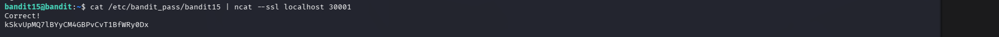

# OverTheWire Bandit – Level 15 → Level 16

## 🎯 Level Objective
The objective of **Bandit Level 15 → Level 16** is to retrieve the next level’s password by **sending the current password to a service running on port 30001 using SSL encryption**.

This level introduces:
- Secure communication using **SSL**
- Using **ncat** with SSL support

---

## 🖥️ Environment Details
- Current User: bandit15
- Target Port: 30001
- Service Type: SSL-enabled service
- Password File: `/etc/bandit_pass/bandit15`

---

## 🔐 Command Used

```bash
cat /etc/bandit_pass/bandit15 | ncat --ssl localhost 30001
```

### 🔍 Command Breakdown
- `cat /etc/bandit_pass/bandit15`  
  → Reads the current level password  
- `|` (pipe)  
  → Passes the password as input  
- `ncat --ssl localhost 30001`  
  → Sends the password securely to the SSL service on port **30001**

---

## 📤 Output Received

```text
Correct!
kSkvUpMQ7lBYyCM4GBPvCvT1BfWRy0Dx
```

---

## 🔑 Password for Next Level (Bandit16)

```text
kSkvUpMQ7lBYyCM4GBPvCvT1BfWRy0Dx
```

---

## 🖼️ Screenshot Evidence

### 📷 Screenshot – SSL Connection Using ncat


---

## 📘 Key Concepts Learned
- Secure socket communication using **SSL**
- Difference between `nc` and `ncat`
- Using `--ssl` flag for encrypted connections
- Sending file content over secure network channels

---

## ✅ Level Status
✔️ Bandit Level 15 → Level 16 Completed Successfully
