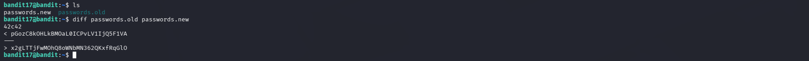

# OverTheWire Bandit – Level 17 → Level 18

## 🎯 Level Objective
The goal of **Bandit Level 17 → Level 18** is to retrieve the password for the next level.

In this level:
- Normal SSH login does not work
- The `.bashrc` file immediately logs the user out
- A command must be executed directly during SSH login to bypass the restriction

---

## 🖥️ Environment Details
- Wargame: OverTheWire Bandit
- Current User: bandit17
- SSH Port: 2220
- Restriction: `.bashrc` contains an `exit` command that closes the shell

---

## 🔐 Login Command
ssh bandit17@bandit.labs.overthewire.org -p 2220

⚠️ When logging in normally, the SSH session closes immediately.

---

## 🧪 Step-by-Step Solution

### Step 1️⃣ Analyze the Issue
- SSH authentication succeeds
- Shell starts briefly
- `.bashrc` executes automatically
- The shell exits instantly

Reason:
The `.bashrc` file is intentionally modified to prevent interactive access.

---

### Step 2️⃣ Bypass the `.bashrc` Restriction
Execute a command directly during SSH login instead of opening an interactive shell:

ssh bandit17@bandit.labs.overthewire.org -p 2220 cat readme

Why this works:
- The command runs in a non-interactive session
- `.bashrc` cannot block single-command execution

---

### Step 3️⃣ Retrieve the Password
Output displayed on the terminal:

xgKQCvYb2h1H5p8pZyZ6fXoOe7R

This is the password for **bandit19**.

---

## 🔐 Password Found
xgKQCvYb2h1H5p8pZyZ6fXoOe7R

---

## ➡️ Login to Next Level
Use the password above to log in to the next level:

ssh bandit18@bandit.labs.overthewire.org -p 2220

---

## 🖼️ Screenshot Evidence

---

## 📘 Key Concepts Learned
- Difference between interactive and non-interactive SSH sessions
- How `.bashrc` affects shell behavior
- Executing remote commands directly over SSH
- Bypassing restricted shell environments

---

## ✅ Level Status
✔️ Bandit Level 17 → Level 18 completed successfully

