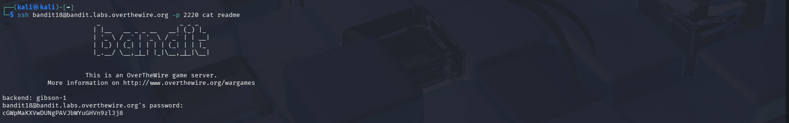

# OverTheWire Bandit – Level 18 → Level 19

## 🎯 Level Objective
The goal of **Bandit Level 18 → Level 19** is to retrieve the password for the next level.

In this level:
- Normal SSH login does not allow interaction
- The shell exits immediately after login
- You must execute a command directly while connecting via SSH

---

## 🖥️ Environment Details
- Wargame: OverTheWire Bandit
- Current User: bandit18
- SSH Port: 2220
- Restriction: Interactive shell access is blocked (forced logout)

---

## 🔐 Login Command
ssh bandit18@bandit.labs.overthewire.org -p 2220

⚠️ Logging in normally results in an immediate logout.

---

## 🧪 Step-by-Step Solution

### Step 1️⃣ Understand the Restriction
- SSH authentication succeeds
- The server immediately exits the shell
- Interactive access is not possible

Reason:
The environment is configured to prevent interactive shell usage.

---

### Step 2️⃣ Execute Command Directly Over SSH
Instead of opening an interactive shell, run a command directly during login:

ssh bandit18@bandit.labs.overthewire.org -p 2220 cat readme

Why this works:
- SSH executes the command in a non-interactive session
- The forced logout does not prevent single-command execution

---

### Step 3️⃣ Retrieve the Password
Output shown after running the command:

cGwMpAKXVvDUnGPAVJbVWuGHvN9zl3j8

This is the password for **bandit19**.

---

## 🔐 Password Found
cGwMpAKXVvDUnGPAVJbVWuGHvN9zl3j8

---

## ➡️ Login to Next Level
Use the password above to log in to the next level:

ssh bandit19@bandit.labs.overthewire.org -p 2220

---

## 🖼️ Screenshot Evidence

# OverTheWire Bandit – Level 18 → Level 19

## 🎯 Level Objective
The goal of **Bandit Level 18 → Level 19** is to retrieve the password for the next level.

In this level:
- Normal SSH login does not allow interaction
- The shell exits immediately after login
- You must execute a command directly while connecting via SSH

---

## 🖥️ Environment Details
- Wargame: OverTheWire Bandit
- Current User: bandit18
- SSH Port: 2220
- Restriction: Interactive shell access is blocked (forced logout)

---

## 🔐 Login Command
ssh bandit18@bandit.labs.overthewire.org -p 2220

⚠️ Logging in normally results in an immediate logout.

---

## 🧪 Step-by-Step Solution

### Step 1️⃣ Understand the Restriction
- SSH authentication succeeds
- The server immediately exits the shell
- Interactive access is not possible

Reason:
The environment is configured to prevent interactive shell usage.

---

### Step 2️⃣ Execute Command Directly Over SSH
Instead of opening an interactive shell, run a command directly during login:

ssh bandit18@bandit.labs.overthewire.org -p 2220 cat readme

Why this works:
- SSH executes the command in a non-interactive session
- The forced logout does not prevent single-command execution

---

### Step 3️⃣ Retrieve the Password
Output shown after running the command:

GwMpAKXVvDUnGPAVJbVWuGHvN9zl3j8

This is the password for **bandit19**.

---

## 🔐 Password Found
GwMpAKXVvDUnGPAVJbVWuGHvN9zl3j8

---

## ➡️ Login to Next Level
Use the password above to log in to the next level:

ssh bandit19@bandit.labs.overthewire.org -p 2220

---

## 🖼️ Screenshot Evidence

---

## 📘 Key Concepts Learned
- Difference between interactive and non-interactive SSH sessions
- Executing remote commands directly over SSH
- Bypassing restricted shell environments
- Understanding SSH command execution flow

---

## ✅ Level Status
✔️ Bandit Level 18 → Level 19 completed successfully

---

## 📘 Key Concepts Learned
- Difference between interactive and non-interactive SSH sessions
- Executing remote commands directly over SSH
- Bypassing restricted shell environments
- Understanding SSH command execution flow

---

## ✅ Level Status
✔️ Bandit Level 18 → Level 19 completed successfully
