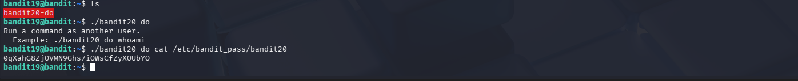

# OverTheWire Bandit – Level 19 → Level 20

## 🎯 Level Objective
The goal of **Bandit Level 19 → Level 20** is to retrieve the password for the next level.

In this level:
- You are logged in as **bandit19**
- A special binary called `bandit20-do` is available
- This binary allows executing commands **as another user**
- You must use it to read the password file of **bandit20**

---

## 🖥️ Environment Details
- Wargame: OverTheWire Bandit
- Current User: bandit19
- Target User: bandit20
- SSH Port: 2220
- Special Binary: `bandit20-do`

---

## 🔐 Login Command
ssh bandit19@bandit.labs.overthewire.org -p 2220

---

## 🧪 Step-by-Step Solution

### Step 1️⃣ List Files in Home Directory
After logging in as `bandit19`, list the files:

ls

Output:
bandit20-do

📌 This binary is the key to solving the level.

---

### Step 2️⃣ Understand the Binary
Run the binary without arguments to see how it works:

./bandit20-do

Output explains:
- It runs a command **as another user**
- Example usage is shown

---

### Step 3️⃣ Execute Command as bandit20
Use the binary to read the password file of `bandit20`:

./bandit20-do cat /etc/bandit_pass/bandit20

Why this works:
- `bandit20-do` has permission to execute commands as `bandit20`
- It bypasses normal permission restrictions
- The password file becomes readable

---

### Step 4️⃣ Retrieve the Password
Output displayed:

0qXaHG82jV0MN9Ghs7iOWsCfZyXOUbYO

This is the password for **bandit20**.

---

## 🔐 Password Found
0qXaHG82jV0MN9Ghs7iOWsCfZyXOUbYO

---

## ➡️ Login to Next Level
Use the password above to log in to the next level:

ssh bandit20@bandit.labs.overthewire.org -p 2220

---

## 🖼️ Screenshot Evidence

---

## 📘 Key Concepts Learned
- Privilege escalation using SUID binaries
- Executing commands as another user
- Understanding controlled privilege delegation
- Reading protected system files securely

---

## ✅ Level Status
✔️ Bandit Level 19 → Level 20 completed successfully
