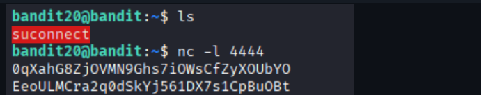
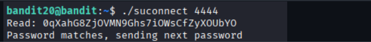

# OverTheWire Bandit – Level 20 → Level 21

## 🎯 Level Objective
The goal of **Bandit Level 20 → Level 21** is to retrieve the password for the next level.

In this level:
- You are logged in as **bandit20**
- A special program called `suconnect` is available
- The program communicates over a TCP port
- You must set up a listener and correctly exchange the password to receive the next one

---

## 🖥️ Environment Details
- Wargame: OverTheWire Bandit
- Current User: bandit20
- Target User: bandit21
- SSH Port: 2220
- Special Binary: `suconnect`
- Network Tool Used: `nc` (netcat)

---

## 🔐 Login Command
ssh bandit20@bandit.labs.overthewire.org -p 2220

---

## 🧪 Step-by-Step Solution

### Step 1️⃣ List Files in Home Directory
After logging in as `bandit20`, list the files:

ls

Output:
suconnect

📌 The `suconnect` binary is required to complete this level.

---

### Step 2️⃣ Start a Netcat Listener
Open a listening port using `nc`:

nc -l 4444

📌 This command opens TCP port **4444** and waits for incoming data.

---

### Step 3️⃣ Send Current Password via Listener
When the listener is running, paste the **current password (bandit20)** into the netcat session:

0qXaHG82jV0MN9Ghs7iOWsCfZyXOUbYO

The listener will then receive the response containing the next password.

---

### Step 4️⃣ Run `suconnect` in Another Terminal
In a second terminal (still logged in as bandit20), execute:

./suconnect 4444

Output:
Read: 0qXaHG82jV0MN9Ghs7iOWsCfZyXOUbYO  
Password matches, sending next password

📌 The program verifies the password sent through the port.

---

### Step 5️⃣ Retrieve the Password
The netcat listener displays the next password:

EeouLMCra2qOdSkYj561DX7s1CpBuOBt

This is the password for **bandit21**.

---

## 🔐 Password Found
EeouLMCra2qOdSkYj561DX7s1CpBuOBt

---

## ➡️ Login to Next Level
Use the password above to log in to the next level:

ssh bandit21@bandit.labs.overthewire.org -p 2220

---

## 🖼️ Screenshot Evidence

---

## 📘 Key Concepts Learned
- TCP communication using netcat
- Client–server interaction on localhost
- Understanding port-based authentication
- Secure password handoff mechanisms
- Using multiple terminals effectively

---

## ✅ Level Status
✔️ Bandit Level 20 → Level 21 completed successfully
