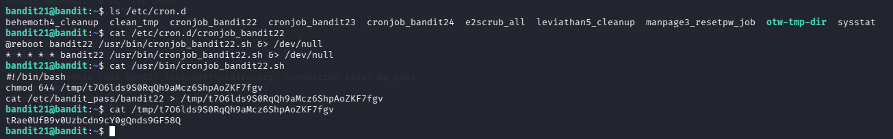

# OverTheWire Bandit – Level 21 → Level 22

## 🎯 Level Objective
The goal of **Bandit Level 21 → Level 22** is to retrieve the password for the next level.

In this level:
- You are logged in as **bandit21**
- A cron job runs periodically for **bandit22**
- You must analyze the cron configuration and script to find where the password is stored

---

## 🖥️ Environment Details
- Wargame: OverTheWire Bandit
- Current User: bandit21
- Target User: bandit22
- SSH Port: 2220
- Mechanism Used: `cron` jobs
- Relevant Directory: `/etc/cron.d`

---

## 🔐 Login Command
ssh bandit21@bandit.labs.overthewire.org -p 2220

---

## 🧪 Step-by-Step Solution

### Step 1️⃣ List Cron Jobs
Check the cron jobs directory:

ls /etc/cron.d

Output includes:
cronjob_bandit22

📌 This cron job is responsible for handling bandit22 tasks.

---

### Step 2️⃣ Read the Cron Job File
View the contents of the cron job:

cat /etc/cron.d/cronjob_bandit22

Output:
@reboot bandit22 /usr/bin/cronjob_bandit22.sh >/dev/null  
* * * * * bandit22 /usr/bin/cronjob_bandit22.sh >/dev/null

📌 This means the script runs every minute as **bandit22**.

---

### Step 3️⃣ Inspect the Cron Script
Read the script being executed:

cat /usr/bin/cronjob_bandit22.sh

Script content:
- Changes permissions of a temporary file
- Copies the password of bandit22 into a temporary file

Example behavior:
- Reads `/etc/bandit_pass/bandit22`
- Writes output to `/tmp/t7061ds9S0RqQh9aMcz6ShpAoZKF7fgv`

---

### Step 4️⃣ Read the Generated Temporary File
Since the cron job runs every minute, read the file it creates:

cat /tmp/t7061ds9S0RqQh9aMcz6ShpAoZKF7fgv

---

### Step 5️⃣ Retrieve the Password
Output displayed:

Trae0ufBwvOUzbcdN9cY0gQnds9GF58Q

This is the password for **bandit22**.

---

## 🔐 Password Found
Trae0ufBwvOUzbcdN9cY0gQnds9GF58Q

---

## ➡️ Login to Next Level
Use the password above to log in to the next level:

ssh bandit22@bandit.labs.overthewire.org -p 2220

---

## 🖼️ Screenshot Evidence

---

## 📘 Key Concepts Learned
- Understanding Linux cron jobs
- Analyzing scheduled task execution
- Reading and interpreting cron scripts
- Using temporary files created by automated processes
- Privilege separation via cron

---

## ✅ Level Status
✔️ Bandit Level 21 → Level 22 completed successfully
