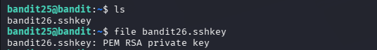
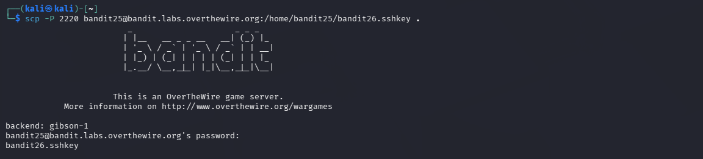
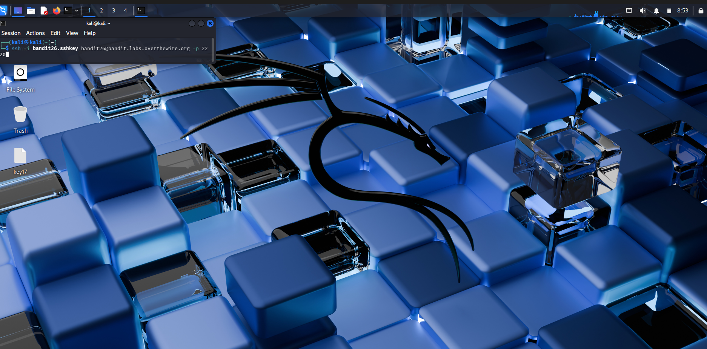
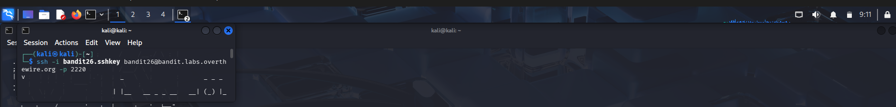
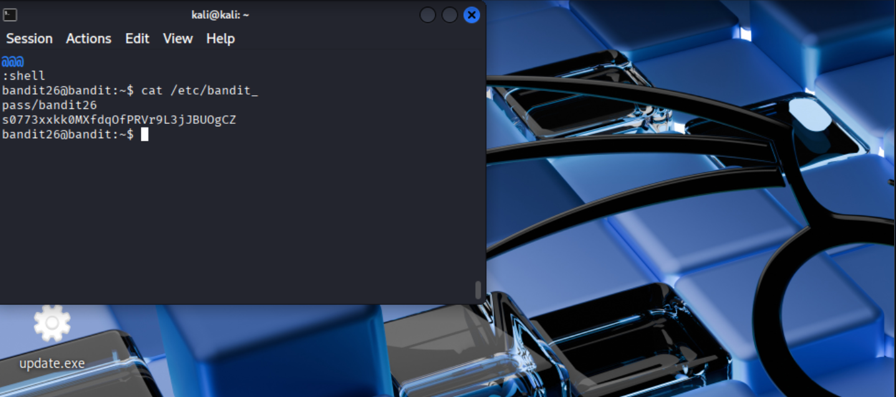

# OverTheWire Bandit – Level 25 → Level 26

## 🎯 Level Objective
The goal of **Bandit Level 25 → Level 26** is to retrieve the password for the next level.

In this level:
- You are logged in as **bandit25**
- SSH login to bandit26 is restricted by a **forced command**
- The login shell launches a pager (`more`)
- You must escape the pager to gain shell access and read the password

---

## 🖥️ Environment Details
- Wargame: OverTheWire Bandit
- Current User: bandit25
- Target User: bandit26
- SSH Port: 2220
- Mechanism Used: SSH forced command + pager escape
- Relevant Files:
  - `/etc/passwd`
  - `/etc/bandit_pass/bandit26`

---

## 🔐 Login Command
ssh bandit25@bandit.labs.overthewire.org -p 2220

---

## 🧪 Step-by-Step Solution

### Step 1️⃣ Inspect the Bandit26 Shell
Check the shell assigned to **bandit26**:

cat /etc/passwd | grep bandit26

Output shows:
bandit26:x:11026:11026::/home/bandit26:/usr/bin/showtext

📌 Bandit26 does **not** use a normal shell like `/bin/bash`.

---

### Step 2️⃣ Examine the Forced Command
Inspect the custom shell:

cat /usr/bin/showtext

Script behavior:
- Displays a text file using `more`
- Immediately exits after display

📌 This means SSH login launches a **pager**, not a shell.

---

### Step 3️⃣ Trigger the Pager Properly
When logging in as bandit26, ensure the terminal window is **small** so that `more` is activated.

ssh bandit26@bandit.labs.overthewire.org -p 2220

📌 If the screen is too large, the pager exits automatically.

---

### Step 4️⃣ Escape the Pager
When the `more` pager opens:
Press:
v

📌 This opens the file inside **vi editor**.

---

### Step 5️⃣ Escape to a Shell from vi
Inside `vi`, type:

:set shell=/bin/bash  
:shell

📌 You now have a shell as **bandit26**.

---

### Step 6️⃣ Retrieve the Password
Read the password file:

cat /etc/bandit_pass/bandit26

---

## 🔐 Password Found

s0773xxkk0MXfdQfPRVr9L3jJBU0gCZ

---

## ➡️ Login to Next Level
Use the password above to log in to the next level:

ssh bandit26@bandit.labs.overthewire.org -p 2220

---

## 🖼️ Screenshot Evidence

---

## 📘 Key Concepts Learned
- SSH forced commands
- Pager (`more`) escape techniques
- vi shell escape
- Restricted shell bypass
- Understanding `/etc/passwd` shells

---

## ✅ Level Status
✔️ Bandit Level 25 → Level 26 completed successfully
