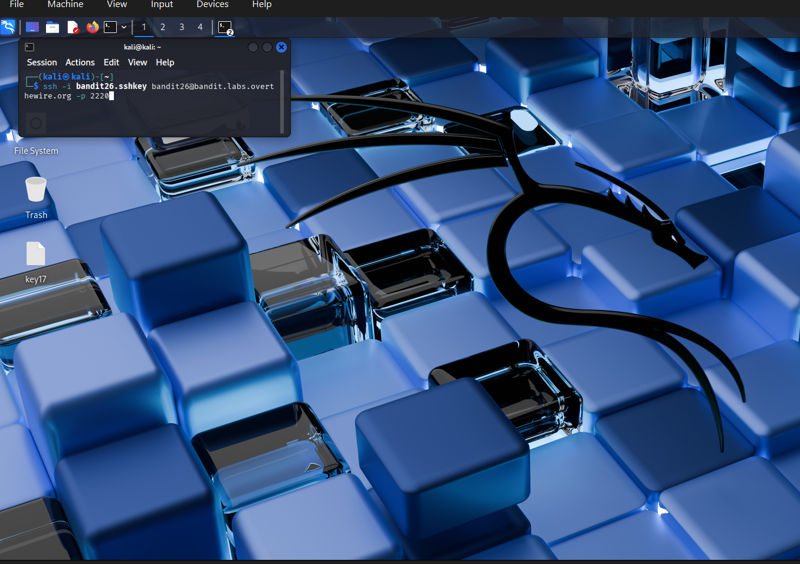
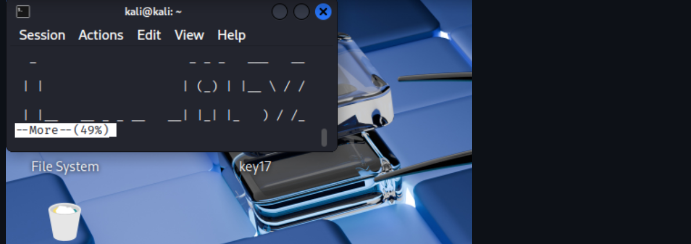
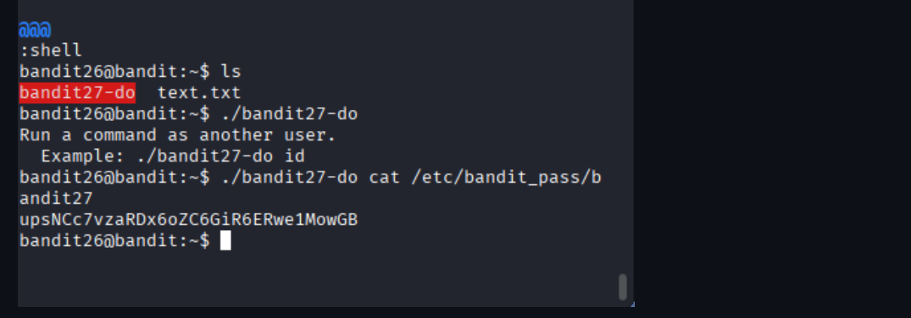

# OverTheWire Bandit – Level 26 → Level 27

🎯 Level Objective  
The goal of Bandit Level 26 → Level 27 is to retrieve the password for the next level.

In this level:
- You are logged in as bandit26
- A special SetUID binary allows executing commands as bandit27
- You must use this binary to read the password file of bandit27

────────────────────────────────────────

🖥️ Environment Details  
Wargame: OverTheWire Bandit  
Current User: bandit26  
Target User: bandit27  
SSH Port: 2220  
Mechanism Used: SetUID executable  
Relevant Files:
- bandit27-do
- /etc/bandit_pass/bandit27

────────────────────────────────────────

🔐 Starting Point  
You already have shell access as bandit26 (after escaping the restricted shell in the previous level).

────────────────────────────────────────

🧪 Step-by-Step Solution  

Step 1️⃣ List Files in Home Directory  
Command:
ls

Output:
bandit27-do
text.txt

Explanation:  
The file bandit27-do is a special executable that can run commands as bandit27.

────────────────────────────────────────

Step 2️⃣ Understand the Binary  
Command:
./bandit27-do

Output:
Run a command as another user.  
Example: ./bandit27-do id

Explanation:  
This confirms the binary is designed to execute commands as bandit27.

────────────────────────────────────────

Step 3️⃣ Execute Command as bandit27  
Command:
./bandit27-do cat /etc/bandit_pass/bandit27

Explanation:  
Using the helper binary, we directly read the password file belonging to bandit27.

────────────────────────────────────────

🔐 Password Found  
upsNCc7vzaRDx6oZC6GiR6ERwe1MowGB

────────────────────────────────────────

➡️ Login to Next Level  
Command:
ssh bandit27@bandit.labs.overthewire.org -p 2220

────────────────────────────────────────

🖼️ Screenshot Evidence  

────────────────────────────────────────

📘 Key Concepts Learned  
- SetUID executables  
- Privilege escalation via helper binaries  
- Executing commands as another user  

────────────────────────────────────────

✅ Level Status  
✔️ Bandit Level 26 → Level 27 completed successfully
