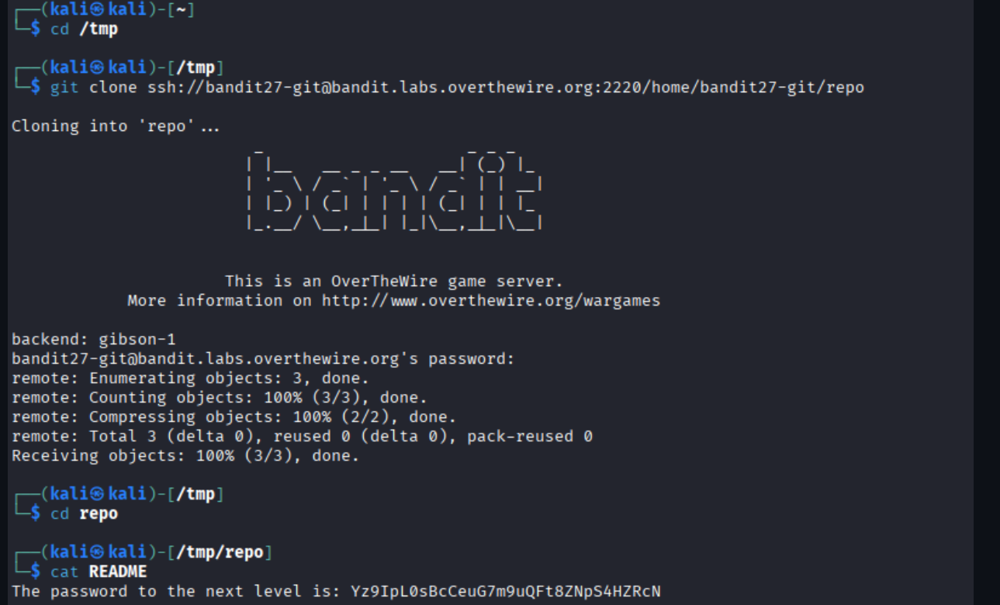

# OverTheWire Bandit – Level 27 → Level 28

🎯 Level Objective  
The goal of Bandit Level 27 → Level 28 is to retrieve the password for the next level.

In this level:
- You are logged in as bandit27
- A remote Git repository is provided
- The password for the next level is stored inside the repository
- You must clone the repository and read its contents

────────────────────────────────────────

🖥️ Environment Details  
Wargame: OverTheWire Bandit  
Current User: bandit27  
Target User: bandit28  
SSH Port: 2220  
Mechanism Used: Git repository access over SSH  
Relevant Details:
- Remote Git server: bandit.labs.overthewire.org
- Repository path: /home/bandit27-git/repo

────────────────────────────────────────

🔐 Starting Point  
You are logged in locally (for example, Kali Linux) and have the password for bandit27.

────────────────────────────────────────

🧪 Step-by-Step Solution  

Step 1️⃣ Move to a Temporary Directory  
Command:
cd /tmp

Explanation:  
Using /tmp ensures we have write permissions and do not clutter other directories.

────────────────────────────────────────

Step 2️⃣ Clone the Remote Git Repository  
Command:
git clone ssh://bandit27-git@bandit.labs.overthewire.org:2220/home/bandit27-git/repo

Explanation:  
This command connects to the OverTheWire Git server over SSH and clones the repository locally.  
When prompted for a password, enter the bandit27 password.

────────────────────────────────────────

Step 3️⃣ Enter the Cloned Repository  
Command:
cd repo

Explanation:  
After cloning, a directory named `repo` is created containing the repository files.

────────────────────────────────────────

Step 4️⃣ Inspect Repository Contents  
Command:
ls

Explanation:  
This reveals files stored in the repository, including a README file.

────────────────────────────────────────

Step 5️⃣ Read the README File  
Command:
cat README

Explanation:  
The README file contains the password for the next level.

────────────────────────────────────────

🔐 Password Found  
Yz9IpL0sBcCeuG7m9uQFt8ZNpS4HZRcN

────────────────────────────────────────

➡️ Login to Next Level  
Command:
ssh bandit28@bandit.labs.overthewire.org -p 2220

────────────────────────────────────────

🖼️ Screenshot Evidence  

────────────────────────────────────────

📘 Key Concepts Learned  
- Cloning Git repositories over SSH  
- Using non-standard SSH ports with Git  
- Reading repository contents to extract sensitive data  

────────────────────────────────────────

✅ Level Status  
✔️ Bandit Level 27 → Level 28 completed successfully
