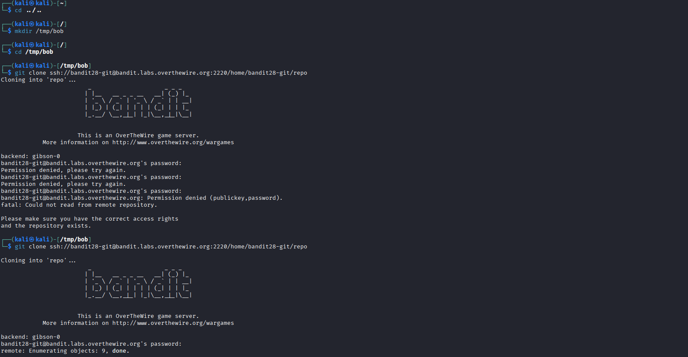
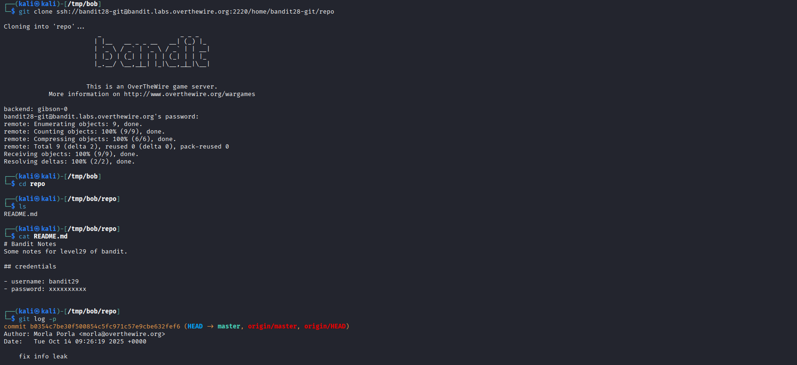
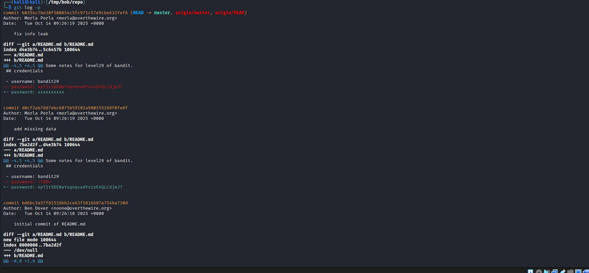

# OverTheWire Bandit – Level 28 → Level 29

🎯 Level Objective  
The goal of Bandit Level 28 → Level 29 is to retrieve the password for the next level.

In this level:
- You are logged in as bandit28
- A Git repository is provided
- The current README does NOT show the password
- The password exists in the **Git commit history**
- You must inspect previous commits to find it

────────────────────────────────────────

🖥️ Environment Details  
Wargame: OverTheWire Bandit  
Current User: bandit28  
Target User: bandit29  
SSH Port: 2220  
Mechanism Used: Git commit history inspection  
Relevant Files:
- README.md
- Git commit log

────────────────────────────────────────

🔐 Starting Point  
You have already cloned the repository provided in the previous level and are inside the repo directory.

────────────────────────────────────────

🧪 Step-by-Step Solution  

Step 1️⃣ Navigate to the Repository  
Command:
cd /tmp/<your-folder>/repo

Explanation:  
Move into the cloned Git repository directory.

────────────────────────────────────────

Step 2️⃣ View Git Commit History  
Command:
git log -p

Explanation:  
The `-p` option shows patch (diff) information for each commit, revealing changes made to files.

────────────────────────────────────────

Step 3️⃣ Inspect Older Commits  
Observation from commit history:
- Earlier commits contain credentials inside README.md
- A later commit removes or hides the password
- The password can be found in a previous diff

────────────────────────────────────────

Step 4️⃣ Identify the Password in Diff Output  
From the commit diff:
- username: bandit29
- password was visible in an earlier commit before being replaced

────────────────────────────────────────

🔐 Password Found  
4pT1t5DENaYuqnqvadYs1oE4QLCdjmJ7

────────────────────────────────────────

➡️ Login to Next Level  
Command:
ssh bandit29@bandit.labs.overthewire.org -p 2220

────────────────────────────────────────

🖼️ Screenshot Evidence  

────────────────────────────────────────

📘 Key Concepts Learned  
- Git commit history analysis  
- Using `git log -p` to inspect changes  
- Recovering sensitive data from version control  
- Importance of not committing secrets  

────────────────────────────────────────

✅ Level Status  
✔️ Bandit Level 28 → Level 29 completed successfully
