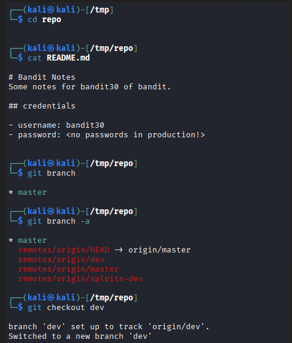
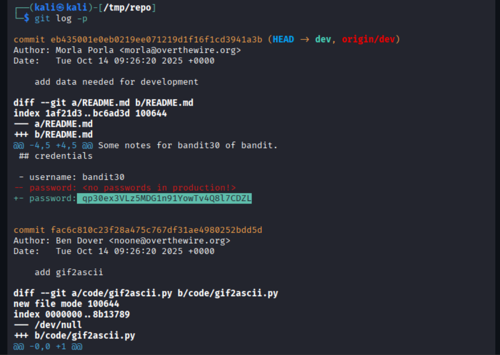

# OverTheWire Bandit – Level 29 → Level 30

🎯 Level Objective  
The goal of **Bandit Level 29 → Level 30** is to retrieve the password for the next level.

In this level:
- You are logged in as **bandit29**
- A Git repository is provided
- The password is **not in the master branch**
- The password exists in another branch (`dev`)
- You must inspect branch history to find it

────────────────────────────────────────

🖥️ Environment Details  
Wargame: OverTheWire Bandit  
Current User: bandit29  
Target User: bandit30  
SSH Port: 2220  
Mechanism Used: Git branch & commit inspection  
Relevant Files:
- README.md
- Git branches (`master`, `dev`)

────────────────────────────────────────

🔐 Starting Point  
You have already cloned the Git repository for bandit29 and are inside the repository directory.

────────────────────────────────────────

🧪 Step-by-Step Solution  

Step 1️⃣ Move Into the Repository  
Command:
cd /tmp/repo

Explanation:  
Navigate into the cloned repository directory.

────────────────────────────────────────

Step 2️⃣ List Available Git Branches  
Command:
git branch -a

Explanation:  
This shows all local and remote branches.  
You will notice a **dev** branch in addition to **master**.

────────────────────────────────────────

Step 3️⃣ Switch to the Development Branch  
Command:
git checkout dev

Explanation:  
The password is not stored in the master branch but exists in the dev branch.

────────────────────────────────────────

Step 4️⃣ View Commit History with Changes  
Command:
git log -p

Explanation:  
The `-p` flag shows the full diff of each commit, allowing us to see removed or added secrets.

────────────────────────────────────────

Step 5️⃣ Identify Credentials in Commit Diff  
Observation from README.md diff:
- username: bandit30
- password was added in the dev branch
- The commit message mentions “add data needed for development”

────────────────────────────────────────

🔐 Password Found  
qp30ex3VLz5MDG1n91YowTv4Q8l7CDZL

────────────────────────────────────────

➡️ Login to Next Level  
Command:
ssh bandit30@bandit.labs.overthewire.org -p 2220

────────────────────────────────────────

🖼️ Screenshot Evidence  

────────────────────────────────────────

📘 Key Concepts Learned  
- Git branch enumeration  
- Switching branches with `git checkout`  
- Inspecting commit diffs using `git log -p`  
- Recovering sensitive data from non-production branches  

────────────────────────────────────────

✅ Level Status  
✔️ Bandit Level 29 → Level 30 completed successfully
