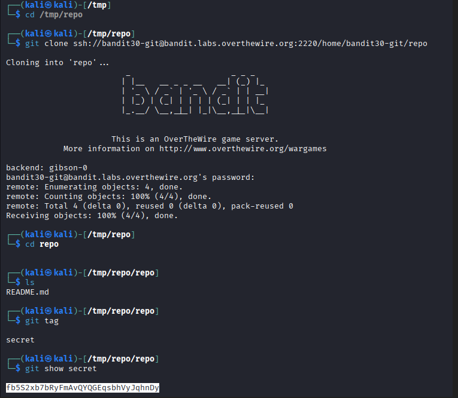

# OverTheWire Bandit – Level 30 → Level 31

🎯 Level Objective  
The goal of **Bandit Level 30 → Level 31** is to retrieve the password for the next level.

In this level:
- You are logged in as **bandit30**
- A Git repository is provided
- The password is NOT in the README
- The password is stored inside a **Git tag**
- You must inspect Git tags to retrieve it

────────────────────────────────────────

🖥️ Environment Details  
Wargame: OverTheWire Bandit  
Current User: bandit30  
Target User: bandit31  
SSH Port: 2220  
Mechanism Used: Git tags inspection  
Relevant Files:
- README.md
- Git tags

────────────────────────────────────────

🔐 Starting Point  
You are logged in on your local machine (e.g., Kali Linux) and have the password for bandit30.

────────────────────────────────────────

🧪 Step-by-Step Solution  

Step 1️⃣ Move to a Temporary Directory  
Command:
cd /tmp

Explanation:  
Using `/tmp` ensures write permissions and avoids clutter.

────────────────────────────────────────

Step 2️⃣ Clone the Git Repository  
Command:
git clone ssh://bandit30-git@bandit.labs.overthewire.org:2220/home/bandit30-git/repo

Explanation:  
This clones the repository for level 30.  
When prompted, enter the **bandit30 password**.

────────────────────────────────────────

Step 3️⃣ Enter the Repository Directory  
Command:
cd repo

Explanation:  
After cloning, the repository contents are available inside the `repo` directory.

────────────────────────────────────────

Step 4️⃣ List Repository Files  
Command:
ls

Output:
README.md

Explanation:  
Only a README file is visible, but it does not contain the password.

────────────────────────────────────────

Step 5️⃣ List Available Git Tags  
Command:
git tag

Output:
secret

Explanation:  
A Git tag named **secret** exists and may contain hidden information.

────────────────────────────────────────

Step 6️⃣ Inspect the Git Tag  
Command:
git show secret

Explanation:  
This command displays the contents associated with the tag.

────────────────────────────────────────

🔐 Password Found  
fb5S2xb7bRyFmAVQYQGQqsbHvJqhnDy

────────────────────────────────────────

➡️ Login to Next Level  
Command:
ssh bandit31@bandit.labs.overthewire.org -p 2220

────────────────────────────────────────

🖼️ Screenshot Evidence  

────────────────────────────────────────

📘 Key Concepts Learned  
- Git tags and their purpose  
- Listing tags using `git tag`  
- Viewing tag contents with `git show`  
- Storing and recovering secrets from version control metadata  

────────────────────────────────────────

✅ Level Status  
✔️ Bandit Level 30 → Level 31 completed successfully
