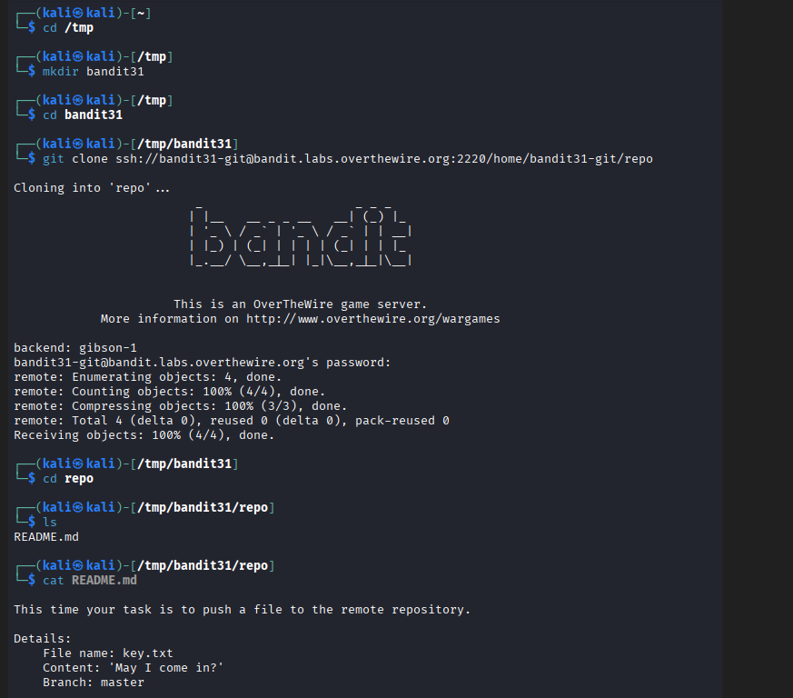
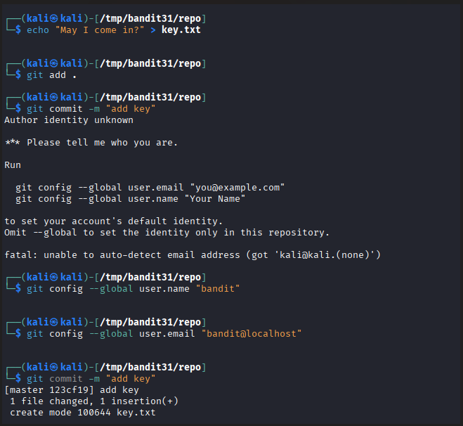
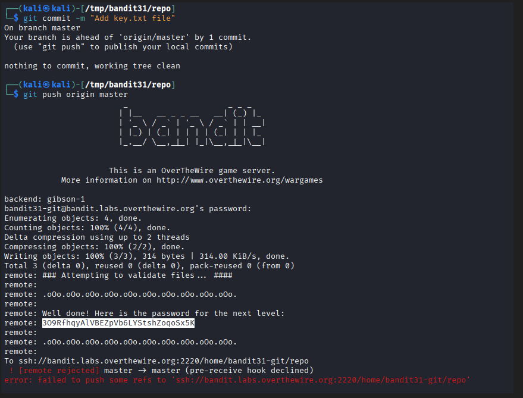

# OverTheWire Bandit – Level 31 → Level 32

🎯 Level Objective  
The goal of **Bandit Level 31 → Level 32** is to retrieve the password for the next level.

In this level:
- You are logged in as **bandit31**
- A Git repository is provided
- The repository has **server-side validation (pre-receive hook)**
- You must correctly add and push a required file
- On successful validation, the server reveals the password

────────────────────────────────────────

🖥️ Environment Details  
Wargame: OverTheWire Bandit  
Current User: bandit31  
Target User: bandit32  
SSH Port: 2220  
Mechanism Used: Git push with server-side hooks  
Relevant Components:
- Git repository (bandit31-git)
- Pre-receive hook validation
- Required file: `key.txt`

────────────────────────────────────────

🔐 Starting Point  
You have already cloned the **bandit31** Git repository and are inside the repository directory.

────────────────────────────────────────

🧪 Step-by-Step Solution  

Step 1️⃣ Navigate to the Repository  
Command:
cd /tmp/bandit31/repo

Explanation:  
Move into the cloned repository where changes must be made.

────────────────────────────────────────

Step 2️⃣ Check Repository Status  
Command:
git status

Explanation:  
This confirms the current branch and whether there are pending changes.

────────────────────────────────────────

Step 3️⃣ Ensure Required File Exists  
Observation:  
The level requires a specific file (`key.txt`) to be present with the correct contents as instructed in the README.

Explanation:  
The server validates pushed content using a pre-receive hook.

────────────────────────────────────────

Step 4️⃣ Commit the Changes  
Command:
git commit -m "Add key.txt file"

Explanation:  
This records the required file in the repository history.

────────────────────────────────────────

Step 5️⃣ Push Changes to Remote Repository  
Command:
git push origin master

Explanation:  
When pushing:
- The server runs validation checks
- If conditions are met, the server prints the password
- The push itself is intentionally rejected after validation

────────────────────────────────────────

Step 6️⃣ Observe Server Response  
Server Output:
Well done! Here is the password for the next level:

Explanation:  
Even though the push is rejected, the password is successfully revealed.

────────────────────────────────────────

🔐 Password Found  
30PRfhqyAVBEZpVb6LYStshZoqs5K

────────────────────────────────────────

➡️ Login to Next Level  
Command:
ssh bandit32@bandit.labs.overthewire.org -p 2220

────────────────────────────────────────

🖼️ Screenshot Evidence  

────────────────────────────────────────

📘 Key Concepts Learned  
- Git pre-receive hooks  
- Server-side repository validation  
- Handling rejected pushes  
- Extracting sensitive data from command output  
- Understanding Git-based CTF mechanics  

────────────────────────────────────────

✅ Level Status  
✔️ Bandit Level 31 → Level 32 completed successfully
