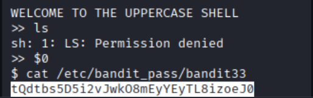

# OverTheWire Bandit – Level 32 → Level 33

🎯 Level Objective  
The goal of **Bandit Level 32 → Level 33** is to retrieve the password for the next level.

In this level:
- You are logged in as **bandit32**
- You are placed inside a restricted **UPPERCASE SHELL**
- All typed commands are automatically converted to uppercase
- Standard commands like `ls` and `cat` fail
- You must bypass the shell restriction to execute normal commands

────────────────────────────────────────

🖥️ Environment Details  
Wargame: OverTheWire Bandit  
Current User: bandit32  
Target User: bandit33  
SSH Port: 2220  
Mechanism Used: Restricted shell / command transformation  
Shell Behavior:
- Converts all input to uppercase
- Executes via `sh`

────────────────────────────────────────

🔐 Starting Point  
After logging in as bandit32, you see:

WELCOME TO THE UPPERCASE SHELL

All commands entered are converted to uppercase before execution.

────────────────────────────────────────

🧪 Step-by-Step Solution  

Step 1️⃣ Attempt a Normal Command (Fails)  
Command:
ls

Result:
LS: Permission denied

Explanation:  
Because the shell converts commands to uppercase, `LS` is not recognized.

────────────────────────────────────────

Step 2️⃣ Escape the Uppercase Shell  
Command:
$0

Explanation:  
`$0` represents the current shell.  
Executing it spawns a **normal shell** without uppercase restrictions.

────────────────────────────────────────

Step 3️⃣ Verify Shell Access  
Command:
ls

Explanation:  
Now the command runs correctly, confirming the restriction is bypassed.

────────────────────────────────────────

Step 4️⃣ Read the Password File  
Command:
cat /etc/bandit_pass/bandit33

Explanation:  
With a normal shell, we can directly read the password file.

────────────────────────────────────────

🔐 Password Found  
tQdtbs5D5i2vJwk08mEyYEyTL8izoeJ0

────────────────────────────────────────

➡️ Login to Next Level  
Command:
ssh bandit33@bandit.labs.overthewire.org -p 2220

────────────────────────────────────────

🖼️ Screenshot Evidence  

────────────────────────────────────────

📘 Key Concepts Learned  
- Restricted shell behavior  
- Environment variables (`$0`)  
- Shell escape techniques  
- Command execution flow in Unix  

────────────────────────────────────────

✅ Level Status  
✔️ Bandit Level 32 → Level 33 completed successfully
